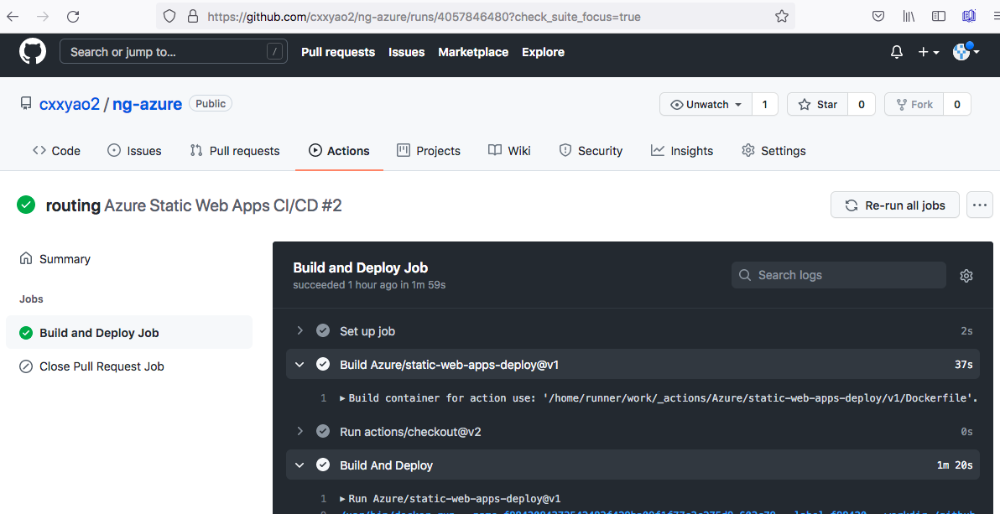
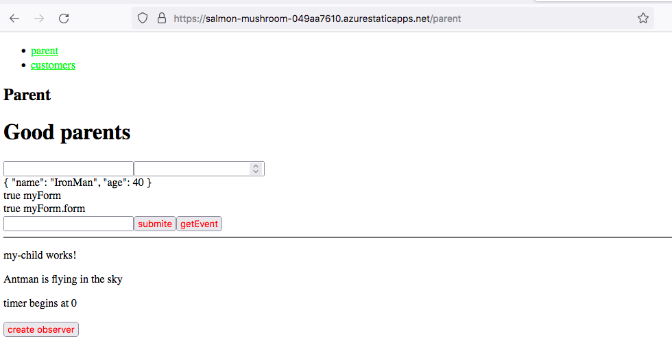
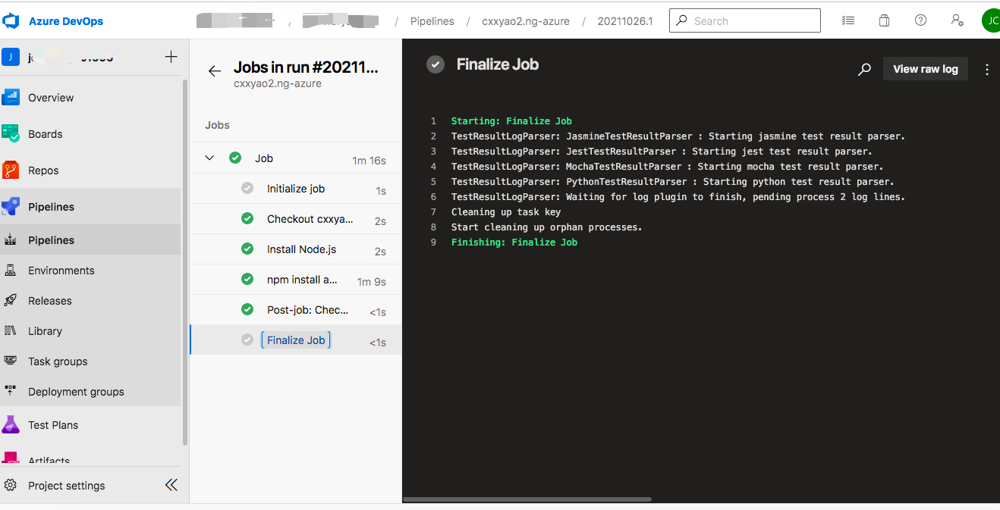

# AngularAzure

This project was generated with [Angular CLI](https://github.com/angular/angular-cli) version 11.0.4.

# Notes

- Set node.js version in the YAML file to be the same as your development environment

# pre-requisitions: import Git repo to Azure  repo
- 
- 

# deploy on azure

> with Azure Static Web App Service and GitHub Actions

- git push ... will trigger building and deploying automatically. Great!

- 
- 

> with app service

- 
